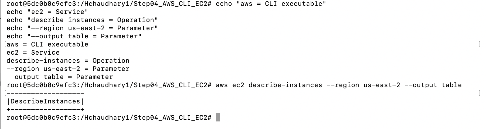
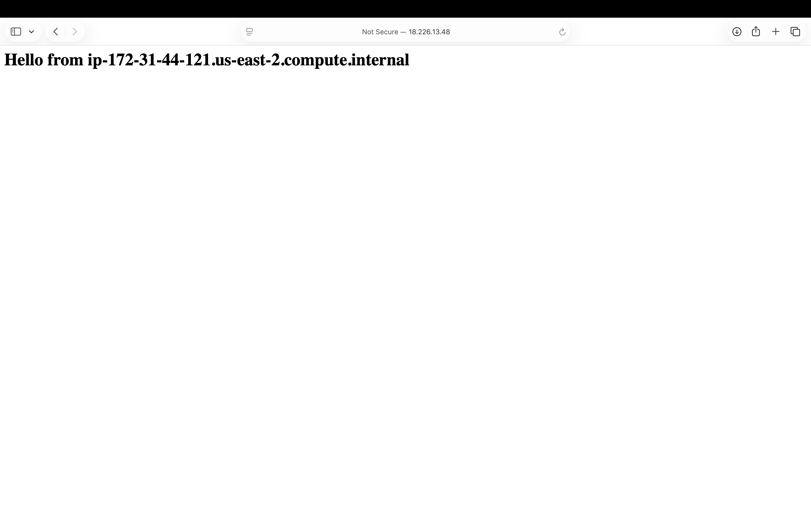
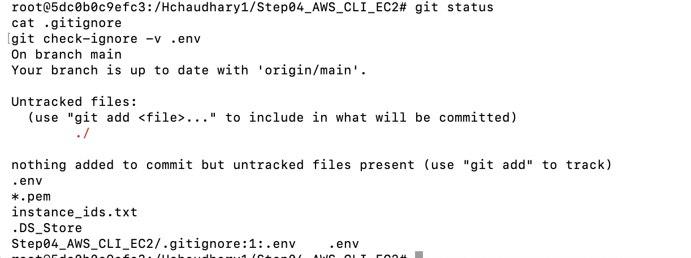
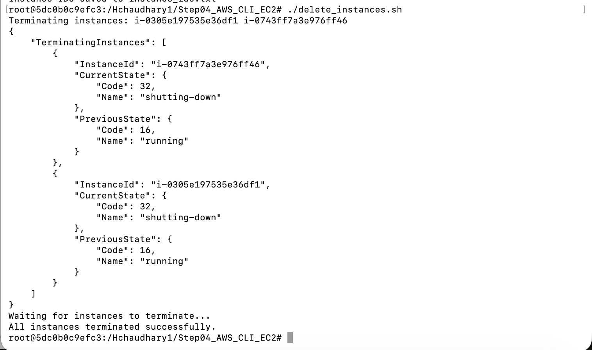

# Week 3 - AWS CLI, EC2, and Environment Variables

## Screenshot 1 - AWS CLI Command Breakdown

## Screenshot 2 - EC2 Web Server

## Screenshot 3 - .env and .gitignore Verification

## Screenshot 4 - Create EC2 Instances

## Screenshot 5 - Delete EC2 Instances

## Environment File Security

Environment files should be excluded from Git because they may contain credentials, secrets, account-specific identifiers, or other environment-specific configuration.

If a `.env` file is committed to a repository, anyone with access to that repository may be able to view those values. Even a private repository is not a completely safe place for credentials because repository permissions can change, accounts can be compromised, or the repository could accidentally become public.

For this reason, `.env` should be listed in `.gitignore`, while a `.env.example` file with placeholder values can be committed to document the configuration required by the project.
