# Week 6 — Two-Tier File Upload & Display with EC2, S3, and IAM Roles

**Cloud Computing Lab | AWS Region: `us-east-2`**

## Project overview

In this lab, I built two Node.js/Express applications and deployed them on separate Amazon EC2 instances. The **Uploader** sends a text file to an Amazon S3 bucket, while the **Viewer** retrieves and displays that file. I used separate IAM roles so that each application only has the AWS permissions it needs. I also used EC2 launch templates to set up the applications when the instances started.

## Architecture and technologies

- **Amazon EC2:** Two `t3.micro` instances, one for the Uploader and one for the Viewer.
- **Amazon S3:** Stores the shared text file as `shared.txt`.
- **AWS IAM:** Separate roles with limited permissions for each application.
- **EC2 launch templates and user-data:** Prepare the applications automatically at launch.
- **Node.js / Express:** Serve the applications on port `3000`.
- **AWS CLI and shell scripts:** Deploy, inspect, and remove the AWS resources.

**File flow:** User → Uploader EC2 → Amazon S3 (`shared.txt`) → Viewer EC2 → Browser.

## 1. Application files and deployment

### Screenshot 1 — Local Uploader and Viewer application files

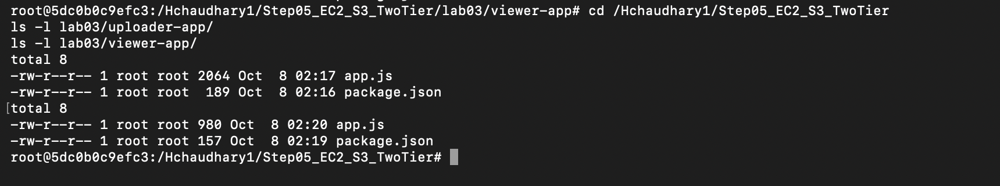

Both the `lab03/uploader-app` and `lab03/viewer-app` folders contain an `app.js` file and a `package.json` file.

### Screenshot 2 — EC2 deployment and public IP addresses

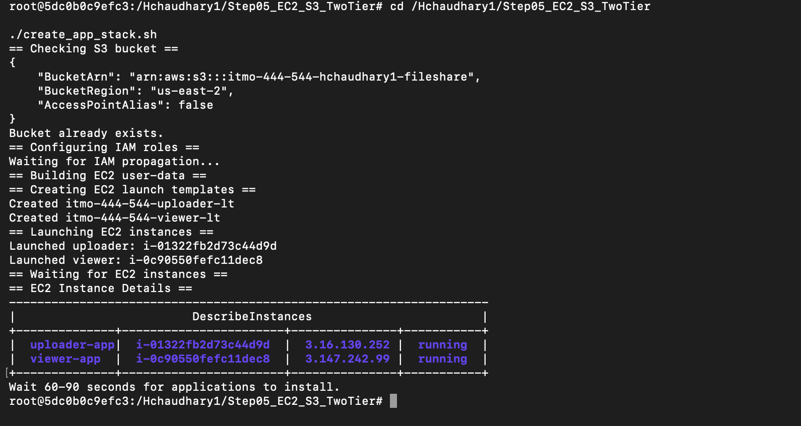

I ran `create_app_stack.sh` to prepare AWS resources and launch the Uploader and Viewer EC2 instances. The command output shows both instances in the `running` state.

## 2. Successful upload and display

### Screenshot 3 — Text file uploaded successfully

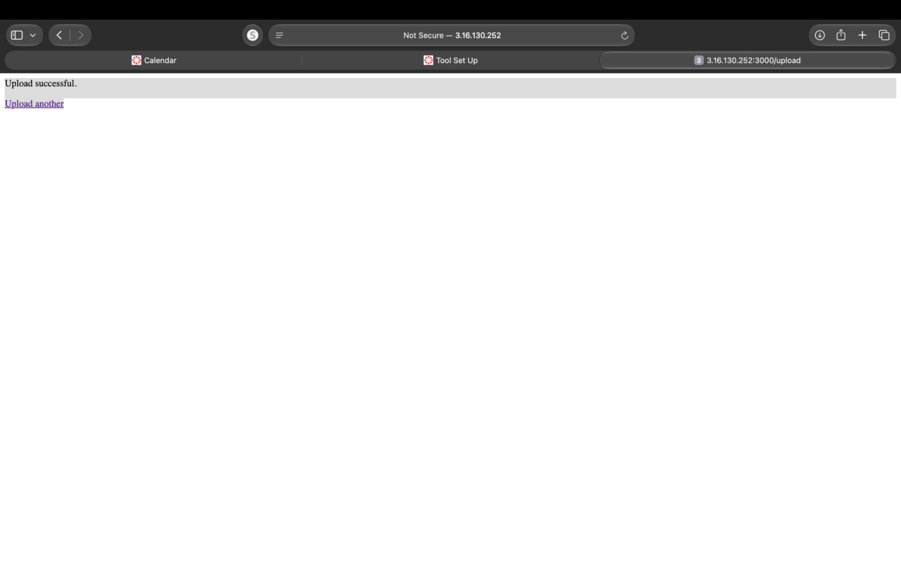

The Uploader confirmed that my test text file was uploaded successfully.

### Screenshot 4 — Viewer displays the first uploaded file

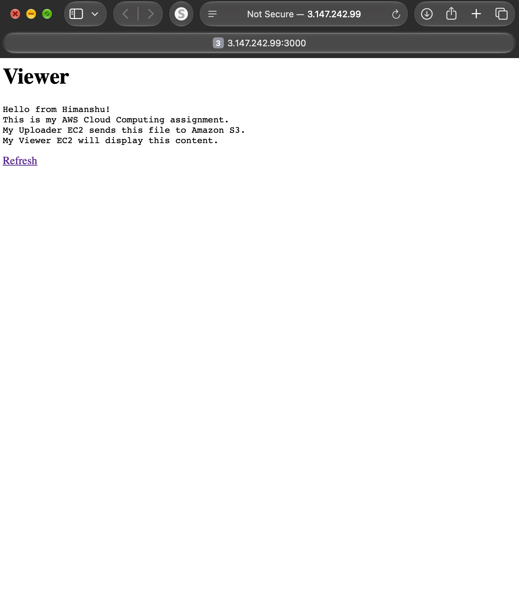

The Viewer retrieved `shared.txt` from Amazon S3 and displayed the text in the browser.

## 3. Live updates and input validation

### Screenshot 5 — Viewer displays the second upload

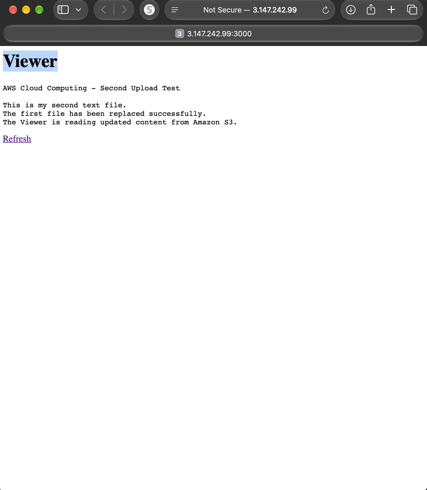

I uploaded a second text file. After refreshing the Viewer, I could see the new content instead of the original text.

### Screenshot 6 — Oversized file rejected

When I tried to upload a file larger than **1 MB**, the Uploader displayed the expected size-limit error.

### Screenshot 7 — Non-text file rejected with HTTP 415

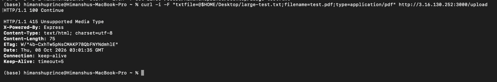

I tested an upload labeled `application/pdf` using `curl`. The server rejected the request with **HTTP 415 Unsupported Media Type**, showing that the file-type check worked.

## 4. EC2 launch templates

### Screenshot 8 — Both launch templates created

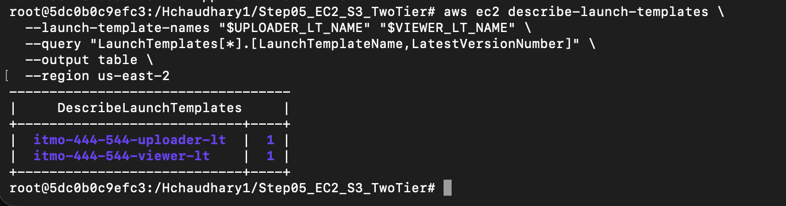

The AWS CLI output lists the Uploader and Viewer EC2 launch templates.

### Screenshot 9 — Uploader launch template versions 1 and 2

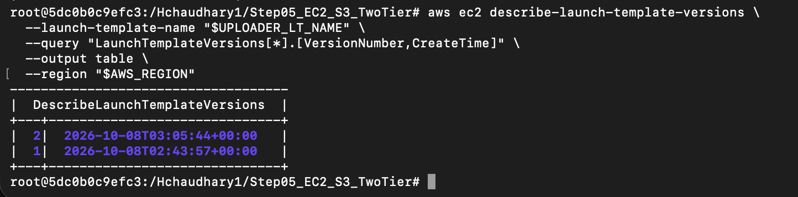

The CLI confirms that the Uploader launch template has **Version 1** and **Version 2**.

### Screenshot 10 — Updated Uploader running Version 2

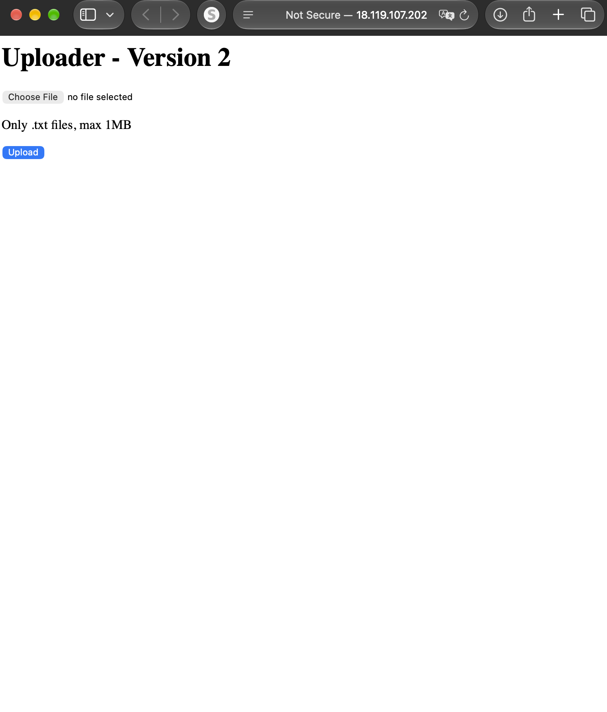

I launched the updated version and verified that the webpage displayed the **Uploader - Version 2** heading.

## 5. Least-privilege IAM permissions

### Screenshot 11 — Uploader IAM role permissions

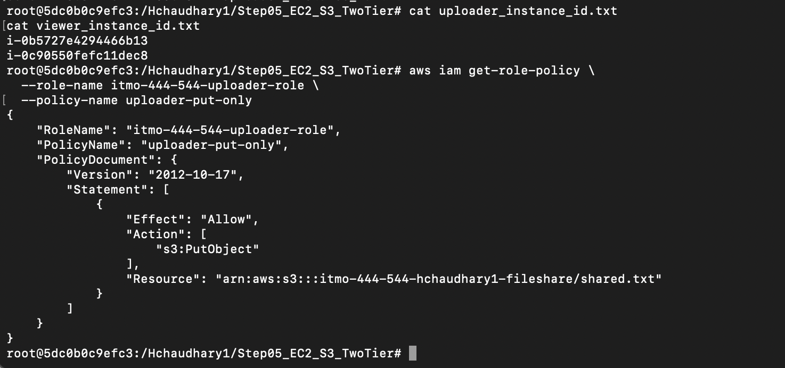

The Uploader's inline policy allows `s3:PutObject` for the specific S3 object `shared.txt`.

### Screenshot 12 — Viewer IAM role permissions

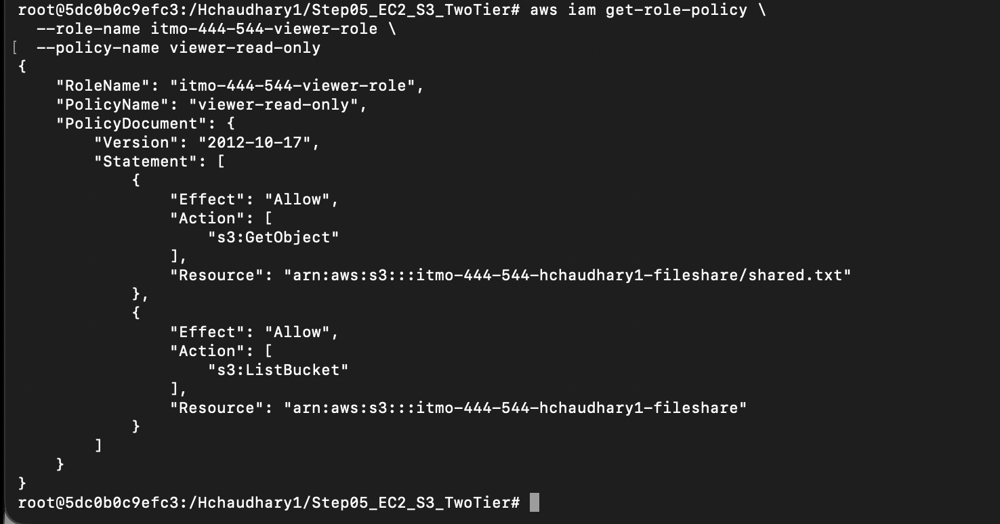

The Viewer's inline policy allows `s3:GetObject` for `shared.txt` and `s3:ListBucket` for the bucket.

## 6. AWS cleanup

### Screenshot 13 — Cleanup script completed

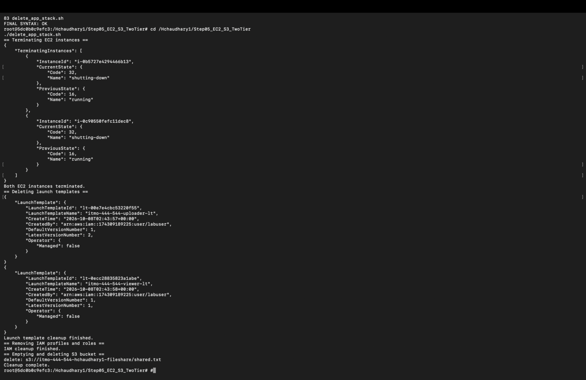

After testing, I ran `delete_app_stack.sh`. The output records EC2 termination and removal of the launch templates, IAM configuration, and S3 object.

| AWS resource | Final result |
|---|---|
| Remaining Uploader EC2 | Terminated (`i-0b5727e4294466b13`) |
| Viewer EC2 | Terminated (`i-0c90550fefc11dec8`) |
| S3 bucket | Not listed in `aws s3 ls` after cleanup |
| Uploader IAM role | `NoSuchEntity` during verification |
| Viewer IAM role | `NoSuchEntity` during verification |
| Launch templates | Deletion confirmed by CLI output |

## 7. GitHub submission

### Screenshot 14 — Repository with Step05 source files

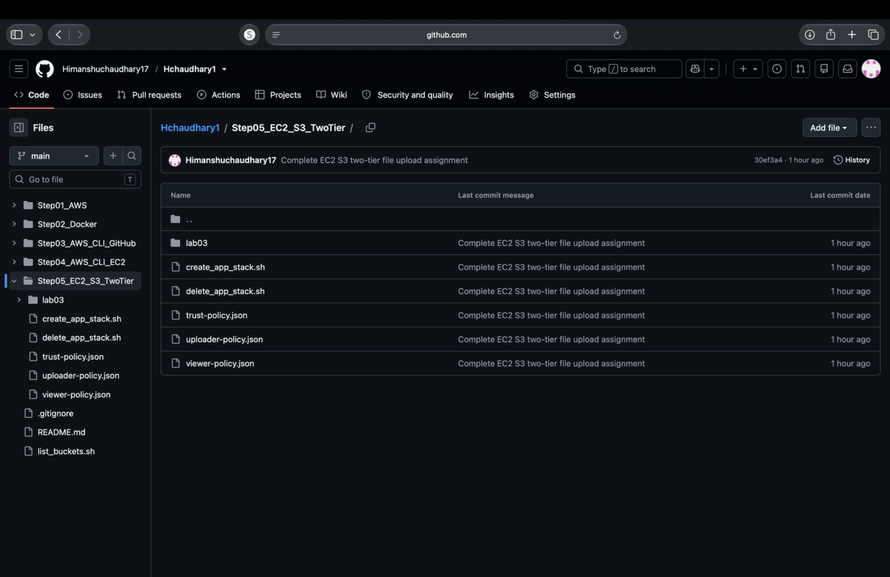

The repository contains my shell scripts, IAM policy documents, and application folders.

**Source code:** [Step05_EC2_S3_TwoTier](https://github.com/Himanshuchaudhary17/Hchaudhary1/tree/main/Step05_EC2_S3_TwoTier)

**Full lab report:** [Cloud Computing EC2 + S3 Report (PDF)](Cloud_Computing_EC2_S3_Final.pdf)

## 8. Required written explanations

### Why the Uploader and Viewer use separate IAM roles

The Uploader and Viewer use separate IAM roles because they perform different tasks and only need access to specific AWS resources. The Uploader's job is to send the `shared.txt` file to Amazon S3, so it only has `s3:PutObject` permission for that object. The Viewer needs to read and display the file, so it has `s3:GetObject` permission for `shared.txt` and `s3:ListBucket` permission for the bucket. By giving each application only the permissions it needs, I reduced unnecessary access. This also limits what an application could do if its EC2 instance were compromised.

### Why embedding code in user-data removes code-fetch credentials

Instead of downloading the application code from GitHub or S3 whenever an EC2 instance starts, I included the application files directly in the EC2 launch template's user-data. When the instance launches, the startup script creates the required files and sets up the application. This means the instance does not need GitHub credentials or extra S3 permissions just to download its application code. The IAM roles can stay focused on the applications' actual work: writing to and reading from `shared.txt` in Amazon S3.

## Conclusion

This lab gave me practical experience with EC2 deployment, S3 file sharing, least-privilege IAM policies, launch-template versioning, validation tests, and resource cleanup. All the main steps and results are documented in the screenshots above.

> **Security note:** Keep AWS access keys, GitHub tokens, `.env` files, and private SSH keys out of this public repository.
